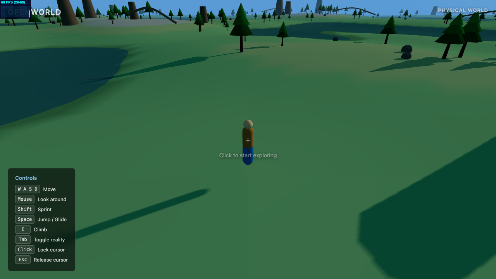

# OpenWorld

A browser-based 3D open world exploration game built with Three.js and React.

**[Play Now](https://fiercefairy.github.io/OpenWorld/)**



## Quick Start

```bash
npm run install:all
npm run dev
```

Open http://localhost:5571 and click the canvas to start exploring.

## Controls

| Key | Action |
|-----|--------|
| `W A S D` | Move |
| `Mouse` | Look around |
| `Shift` | Sprint |
| `Space` | Jump / Glide (when airborne) |
| `E` | Climb (near climbable surfaces) |
| `Tab` | Toggle reality layer |
| `Click` | Lock cursor |
| `Esc` | Release cursor |

## Features

- **Infinite chunked terrain** with 2-level LOD streaming
- **Dual reality system** — toggle between Physical World and Memory Layer with Tab
- **5 movement states** — walking, jumping, climbing, gliding, and balancing
- **Instanced rendering** for trees, rocks, and climbable formations
- **Procedural world** with seeded object placement
- **Narrow balance paths** (bridges/ridgelines) across chunks
- **Multiplayer** via Socket.IO with remote player interpolation
- **Dynamic sky** with rotating sun and player-following shadows
- **Performance monitoring** with drei Stats and PerformanceMonitor

## Architecture

```
client/src/
  App.jsx                        -- Canvas + GameProvider
  contexts/GameContext.jsx        -- Shared state (player pos, active layer)
  hooks/useInput.js               -- Keyboard/mouse/pointer-lock
  systems/
    terrain.js                    -- Height generation, chunk geometry
    objects.js                    -- Seeded object placement per chunk
    reality.js                    -- Layer configs (fog, sky, colors)
    movementState.js              -- State factory, constants
    stateMachine.js               -- FSM transition table
    collisionSystem.js            -- Spatial hash, object collision
    cameraController.js           -- Per-state camera behavior
    narrowPaths.js                -- Balance path generation
    multiplayer.js                -- Socket.IO client
    states/
      grounded.js                 -- Walk/sprint/jump
      airborne.js                 -- Freefall + gravity
      climbing.js                 -- Wall-attached movement
      gliding.js                  -- Slow descent + forward momentum
      balancing.js                -- Narrow path traversal
  components/
    Player.jsx                    -- Thin shell wiring systems
    Sky.jsx                       -- Layer-aware lighting
    Water.jsx                     -- Layer-aware, follows player
    HUD.jsx                       -- Context-sensitive controls
    RemotePlayers.jsx             -- Multiplayer rendering
    world/
      ChunkManager.jsx            -- Terrain + object chunk streaming
      TerrainChunk.jsx            -- Single terrain mesh
      ObjectChunk.jsx             -- Instanced trees/rocks
      NarrowPathChunk.jsx         -- Balance path visuals
    effects/
      LayerFog.jsx                -- Dynamic fog per layer
      RealityTransition.jsx       -- Toggle flash overlay

server/
  index.js                        -- Express + Socket.IO multiplayer
```

- **Client**: React + Three.js + Vite (port 5571)
- **Server**: Express + Socket.IO (port 5570)

## Scripts

| Command | Description |
|---------|-------------|
| `npm run dev` | Start both client and server in dev mode |
| `npm run build` | Build client for production |
| `npm test` | Run server tests |
| `npm run install:all` | Install all dependencies |
